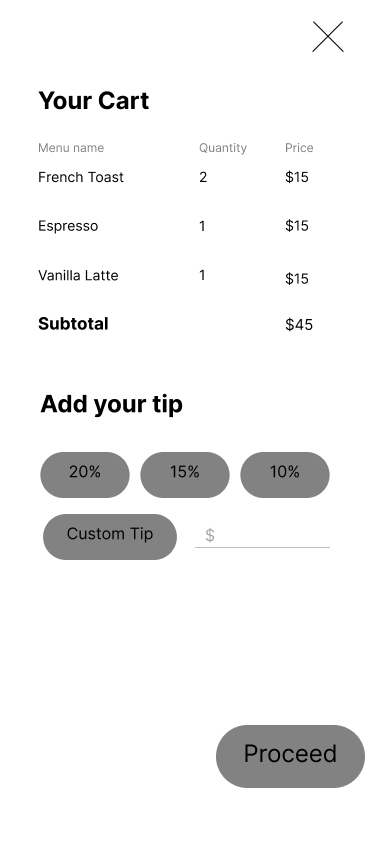

# Link to Figma prototype

[Link to the Figma prototype](https://www.figma.com/proto/oNL3shlU9ftAhLJhArXykj/WillEats-Rapid-Prototype?node-id=67%3A2000&scaling=scale-down&page-id=0%3A1&starting-point-node-id=67%3A2000)

# Figma viewer for the whole picture

[Link to Figma viewer](https://www.figma.com/file/oNL3shlU9ftAhLJhArXykj/WillEats-Rapid-Prototype?node-id=0%3A1&t=nFUgaY08hGL8jAnW-1)

# Home page

* Users can press scan now to enter the restaurant menu.
* Users can login to their account.
* Users can press profile img to login to the account.

# Client login page

* Users can enter email and password to login.
* Users can press login to login.
* Users can signup an account.

# Owner login page

* Users can enter email and password to login.
* Users can press login to login.
* Users can signup an buisness account. 

# Menu page

* Users can press add to cart to add food to the cart.
* Users can press cart to view the items added currently.
* Users can press home icon to go back to home page.
* Users can press profile img to view the account.
* Users can press food card to see the detail of the food and the review about the food.

# Food page

* Users can press add to cart to add the food to the cart.
* Users can scroll down to view more review of the current food.
* Users can press each review to see the detail of the review.

# Cart page

* Users can view the food they added to the cart and the price.
* Users can select or customize the tip.
* Users can press proceed to go to the checkout page.

# Checkout page

* Users can view the total price.
* Users can press pay now to checkout.

# Order finished page

* Users can press view receipt to view the receipt.
* Users can press order more to keep ordering.
* Users can press write reviews to write reviews about the order.

# My Profile Page

* Users can press My Orders to view their previous order
* Users can press My Reviews to view their past reviews
* User can press Account settings to change their account information
* User can press the home button on the top right to go back to the home page

# Account Setting Page

* Users can press update button to update both their Email and their password
* Users can press the save button to save their changes and return the MY-Profile Page

# Past Review Page

* Users can press Edit button to go to a new page that edit the past Reviews
* Users can press the delete review to delete their reviews

# Edit Review

* Users can press the star button to edit the star grades for the dish
* Users can press the Plus sign to add a photo for this review
* Users can press the X sign to delete a photo for this review
* Users can press the save button to save this review

# Past Order Page

* Users can press Write a review to write a new review
* Users can press View my reviews to view previous reviews.

# Past Order Write Review Page1

* Users can use the Drop Down to select which dish they want to write review on
* Users can press the Star to select the grades for the dish
* Users can press the Plus sign in a square to add a new photo for review
* Users can press the Plus sign in a circle to add a review to another dish
* Users can press the submit button to submit the review
* User can write reviews in the text editor

# Past Order Write Review Page2

* Users can press the minus sign to delete the review for dish if they want to

# Other people's Profile Page

* Users can press the review to see other's review

# Owner Client Add Menu

* User can press the Add Images to add image to this dish
* User can write description about the Menu in Description
* User can set the price in the price editor
* User can press the Add menu to update a new item

# Owner Client Edit Menu

* User can press the Edit Images to edit image to this dish
* User can change the description about the dish in Description
* User can change the price in the price editor
* User can press the Add menu to update a new item

